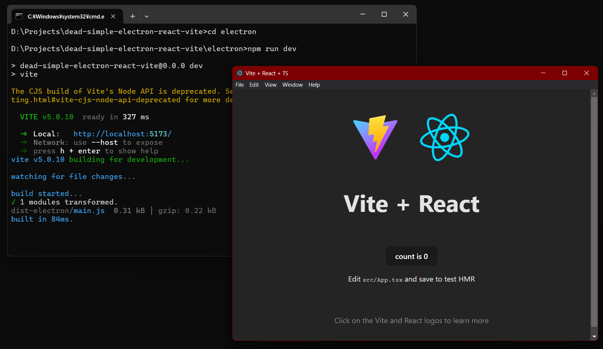

# Dead simple Electron & React & Vite

This is a sample project configuration for using Electron & React & Vite,
minimized, simplest.

I do not like boilerplate, but I decided to create this because there are some details that need to be figured out in order to generate a minimum configuration project for Electron.

This project configuration will enable the following:

* Electron.
* Package generation with Electron-builder.
* React.
* Typescript.
* Build with Vite and Hot Module Replacement.

This project has been carefully constructed to be "minimally structured". Thus, you should have less trouble knowing what is being used and how it is being used.
Still, I am generating commits at each step of building the environment, in case later version upgrades make this code unworkable. This allows us to keep track of what truly needs to be done.

I have tried to deviate as little as possible from the standard Vite+React directory structure. Therefore, general React client-side development techniques may be applied as is.

NOTE: The central hub linking Vite and Electron is [vite-plugin-electron](https://github.com/electron-vite/vite-plugin-electron). Without this Vite plugin, it would not have been so simple. Thanks for a great plugin.

## How to use

Choose between two methods:

* You can clone this repository,
  * Enter `electron` directory and `npm install` to install packages.
  * Then run your Electron app just `npm run dev` while editing the code.
* Or manually apply it to your app, using the comments and diffs from each commit in this repository history as a guide.

To build a redistributable package, use `npm run build`.

## Repository

This repository will always be such that the build sequence is shown at a minimum.
This means that changes may be directly modified and rebased from previous commits, rather than normal committed sequentially.

## License

CC0
